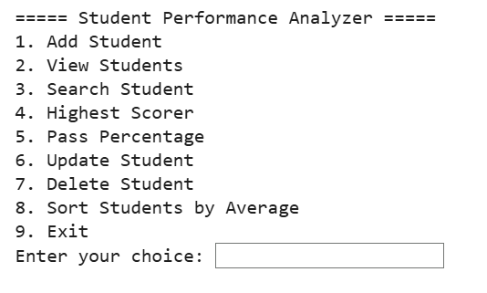
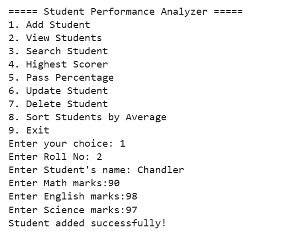
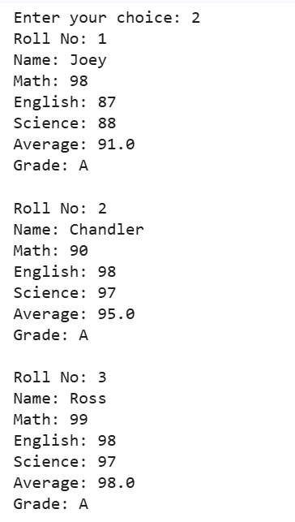
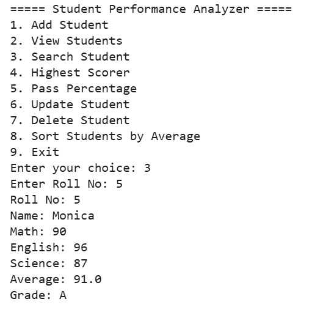
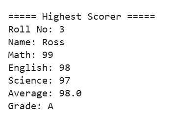
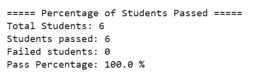
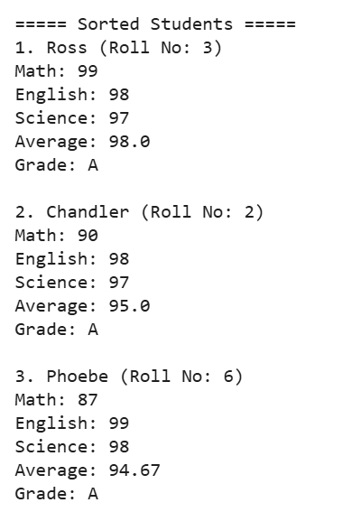

# Student Performance Analyzer

A beginner-friendly command-line application built in Python for managing student records using CSV file handling. The project demonstrates CRUD operations, file handling, input validation, sorting, searching, and performance analysis.

## Project Description

Student Performance Analyzer is a menu-driven Python command-line application designed to manage student academic records efficiently. The application stores student information in a CSV file and provides features such as adding, viewing, searching, updating, deleting, and analyzing student performance through average marks, grades, highest scorer, pass percentage, and student ranking.

## Features

- Add new students
- View all student records
- Search students by Roll Number
- Update student marks
- Delete student records
- Calculate average marks
- Assign grades automatically
- Find the highest scorer
- Calculate class pass percentage
- Sort students by average marks
- Store data permanently using a CSV file
- Validate user inputs

## Technologies Used

- Python 3
- CSV File Handling
- File I/O
- Lists
- Dictionaries
- Functions
- Loops
- Conditional Statements

## Project Structure

```text
Student-Performance-Analyzer/
│
├── student_performance_analyzer.py
├── students.csv
└── README.md
```

## How to Run the Project

1. Clone this repository or download the project files.
2. Make sure Python 3 is installed on your computer.
3. Open the project folder in your terminal or command prompt.
4. Run the program using:

```bash
python student_performance_analyzer.py
```

5. Follow the on-screen menu to manage student records.

## Screenshots

### 1. Main Menu



---

### 2. Add Student

Shows how a new student record is added after validating the roll number, name, and subject marks.



---

### 3. View Students

Displays all student records along with their average marks and assigned grades.



---

### 4. Search Student

Searches for a student using their roll number and displays the complete record.



---

### 5. Highest Scorer

Identifies and displays the student with the highest total marks.



---

### 6. Pass Percentage

Calculates and displays the overall class pass percentage.



---

### 7. Sort Students

Displays students ranked in descending order based on their average marks.




## Learning Outcomes

Through this project, I strengthened my understanding of:

* Python functions and modular programming
* Lists and dictionaries
* CSV file handling
* Input validation and exception handling
* CRUD (Create, Read, Update, Delete) operations
* Sorting and searching techniques
* Writing clean, readable, and well-documented code

## Future Improvements

* Add subject-wise performance analysis
* Export reports as PDF or Excel
* Build a graphical user interface (GUI)
* Store records in a SQL database instead of a CSV file
* Add login functionality for administrators
* Display charts for student performance

## Author

**Maheen Jan**

Economics Graduate | Aspiring Data Analyst | Python Learner

GitHub: [maheenjan0101-ship-it](http://github.com/maheenjan0101-ship-it)

LinkedIn: [Maheen Jan](http://www.linkedin.com/in/maheen-jan)


  
